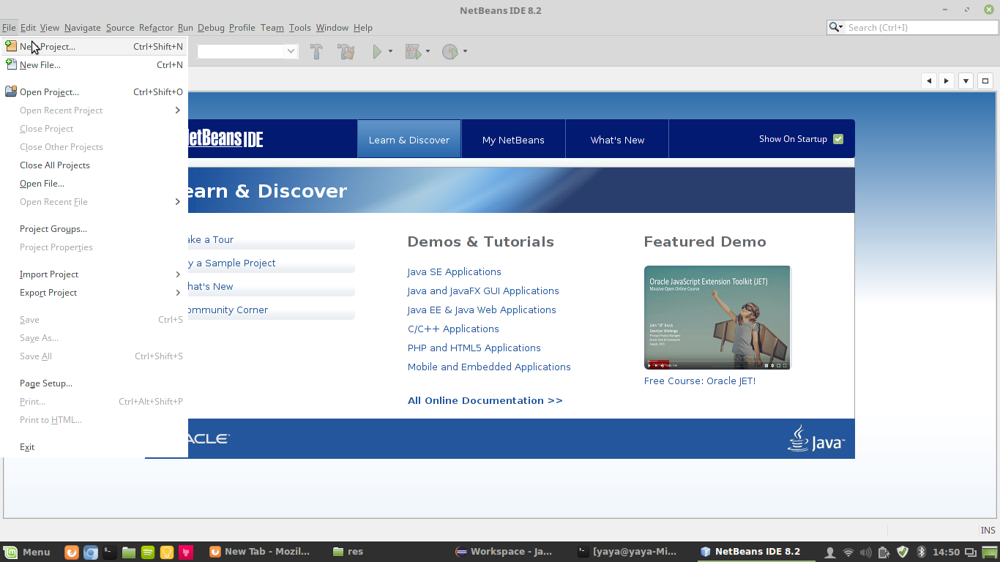
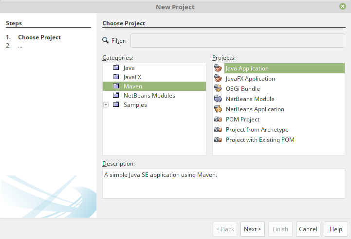
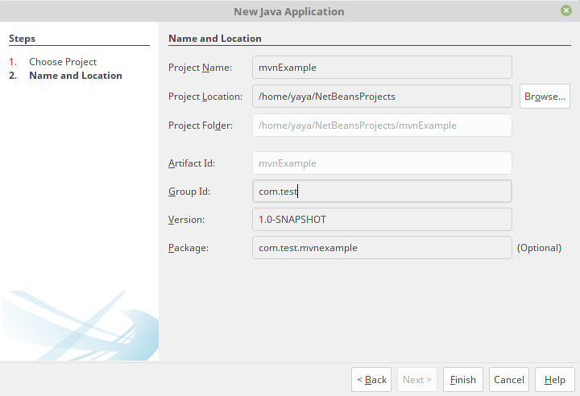
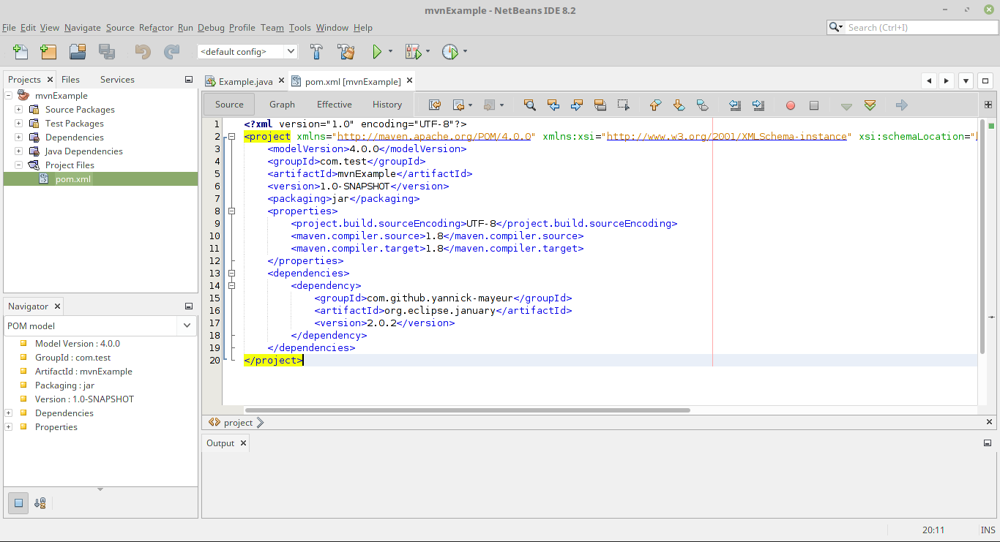
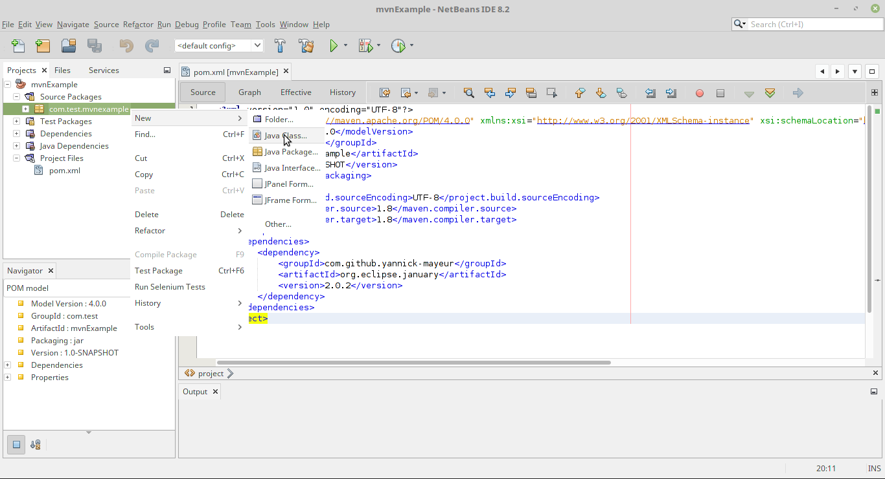

# NetBeans Project using January

## Requirements

* Having [NetBeans Java SE](https://netbeans.org/downloads/) installed
* Having **maven** installed
  * On Windows: https://www.mkyong.com/maven/how-to-install-maven-in-windows/
  * On Linux: `apt install maven`
* Having **Java** 7 or more installed
  * On Windows: https://www.java.com/en/download/
  * On Linux: `apt install openjdk-8-jdk` and `apt install openjdk-8-jre`

## How-to

1. Create a new project in NetBeans. File\>New Project...

   

   Under Maven select, Java Application

   

   Complete the project name and the Group Id, we will be using mvnExample and
com.test

   

2. Click on file called pom.xml and add the following between the two project
   tags:

   ```xml
   <dependencies>
	   <dependency>
		   <groupId>com.github.yannick-mayeur</groupId>
		   <artifactId>org.eclipse.january</artifactId>
		   <version>2.0.2</version>
	   </dependency>
   </dependencies>
   ```

   

3. Create a new Java class with following code in the the main:

   ```java 
   Dataset dataset = DatasetFactory.createFromObject(new double[] { 1,2, 3, 4, 5, 6, 7, 8, 9 });
   // Print the output:
   System.out.println("shape of dataset: " + Arrays.toString(dataset.getShape()));
   System.out.println("toString of dataset: " + dataset.toString());
   System.out.println("toString, with data, of dataset: \n" + dataset.toString(true));
   ```

   

4. Run the code by clicking on the play button and selecting the newly created
   class.
